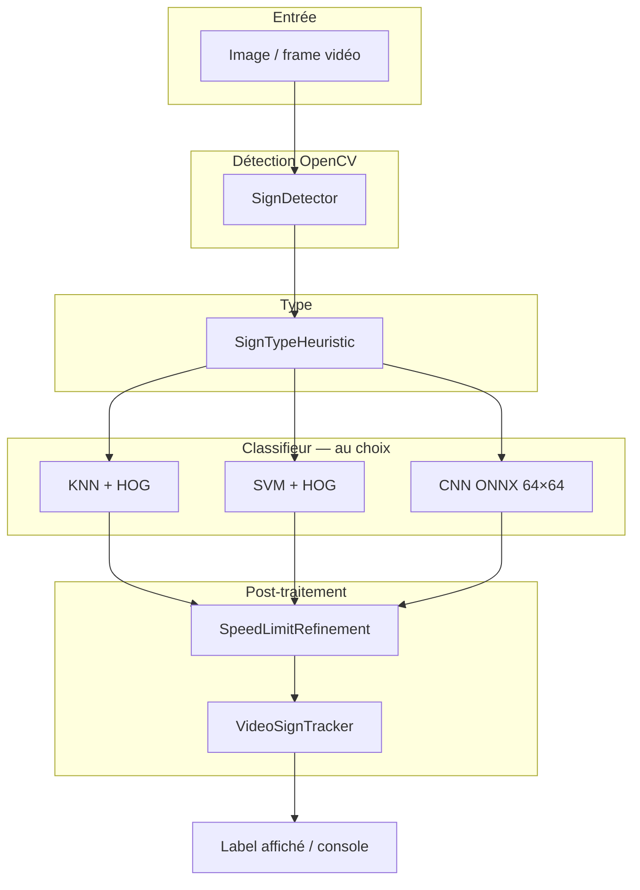

# Road Sign Image Processing — BE Twizy

Reconnaissance de panneaux de signalisation à partir d’images et de vidéos, avec **OpenCV** (Java 21).  
Le projet compare plusieurs méthodes de classification sur les **mêmes crops** et le **même détecteur**.

**Contexte :** Bureau d’étude [Twizy — ARCHE](https://arche.univ-lorraine.fr/course/view.php?id=18190) (ENSEM, vision par ordinateur).

---

## Guide utilisateur rapide

### Prérequis

| Élément | Détail |
|---------|--------|
| Java | **21** (projet Eclipse configuré en JavaSE-21) |
| IDE | Eclipse avec `src/` et bibliothèque **OpenCV 4.x** (`opencv-4130.jar` + DLL natives) |
| Données | Dossier `dataset/` (base fournie : train / valid / test + `_classes.csv`) |
| Option CNN | Python 3 + TensorFlow (`py -3 scripts/train_cnn.py`) |

Sur les postes ENSEM, OpenCV est souvent dans `C:/tools/OpenCV`.  
Pour la **lecture vidéo** sous Windows, le cours recommande de charger la DLL ffmpeg OpenCV si besoin (voir ressources ARCHE).

Chaque programme Java appelle au démarrage :

```java
System.loadLibrary(Core.NATIVE_LIBRARY_NAME);
```

### Installation (première fois)

1. Cloner le dépôt et ouvrir le projet dans **Eclipse**.
2. Vérifier le **classpath** : JRE 21 + jar OpenCV + chemin des DLL natives (`x64`).
3. Placer la base Roboflow dans `dataset/` (non versionnée si trop volumineuse).
4. Lancer **`DatasetFilter`** → crée `dataset_filtered/`.
5. (Optionnel CNN) `py -3 -m pip install -r scripts/requirements-cnn.txt` puis `py -3 scripts/train_cnn.py`.

### Démarrage en 5 étapes

```text
1. DatasetAnalyzer          → statistiques sur dataset/
2. DatasetFilter            → génère dataset_filtered/
3. SignClassifierCompare    → précision KNN + SVM (console + CSV)
4. SceneRecognitionSvm      → test sur une photo (ex. p5.jpg, 110 km/h)
5. VideoRecognitionSvm      → démo vidéo (video1.avi, video2.avi)
```

**Démo soutenance recommandée :** utiliser **SVM** pour les vidéos (`VideoRecognitionSvm`) — meilleure stabilité que le CNN sur les séquences du cours.

---

## Architecture



| Étape | Rôle |
|-------|------|
| `SignDetector` | Panneaux **rouges ronds** (HSV, contours, Hough) |
| `SignTypeHeuristic` | Limite de vitesse vs autre panneau |
| Classifieur | Prédit la classe (KNN, SVM ou CNN) |
| `SpeedLimitRefinement` | Corrections métier (ex. 40→90 en vidéo) |
| `VideoSignTracker` | Stabilise les annonces (séquence 90→70→50 sur `video1`) |

Les variantes `*Svm` et `*Cnn` réutilisent la **même détection** ; seul le classifieur change.

---

## Comparaison des méthodes (rapport / soutenance)

Même protocole : images de `dataset_filtered/test`, un crop par image.

| Méthode | Descripteur | Entraînement | Précision test (indicatif) |
|---------|-------------|--------------|----------------------------|
| **KNN** | HOG (`SpeedLimitFeatures`, `SignFeatures`) | Java / OpenCV | Vitesse **~78 %**, autres **~79 %** |
| **SVM** | HOG (identique à KNN) | Java / OpenCV | Vitesse **~79 %**, autres **~82 %** |
| **CNN** | Pixels RGB 64×64, NCHW | Python → ONNX → Java DNN | Variable (**réentraîner** puis `SignClassifierCnn`) |

| Méthode | Classe d’évaluation | Fichiers résultats |
|---------|---------------------|-------------------|
| KNN | `SignClassifier` | `results/speed_limit_test.csv`, `other_signs_test.csv` |
| SVM | `SignClassifierSvm` | `results/speed_limit_test_svm.csv`, `other_signs_test_svm.csv` |
| CNN | `SignClassifierCnn` | `results/speed_limit_test_cnn.csv`, `other_signs_test_cnn.csv` |

**Tableau comparatif KNN + SVM :**

```text
SignClassifierCompare
```

Le code KNN d’origine est **conservé** ; SVM et CNN sont en **parallèle**, pas en remplacement.

---

## Structure du dépôt

```
RoadSignImageProcessing/
├── src/                    # Sources Java (25 classes)
├── dataset/                # Base Roboflow brute (train, valid, test)
├── dataset_filtered/       # Généré par DatasetFilter (~8 000 images)
├── external_images/        # Photos et vidéos de test (p5.jpg, video1.avi, …)
├── results/                # Rapports CSV d’évaluation
├── models/                 # CNN : speed_cnn.onnx, other_cnn.onnx, labels
├── scripts/                # train_cnn.py, eval_cnn_onnx.py
├── detected_signs/         # Crops extraits d’une scène
└── README.md
```

---

## Programmes principaux

| Classe | Rôle |
|--------|------|
| `DatasetAnalyzer` | Statistiques CSV Roboflow |
| `DatasetFilter` | Filtre et copie vers `dataset_filtered/` |
| `SignClassifier` | Entraîne + évalue **KNN** |
| `SignClassifierSvm` | Entraîne + évalue **SVM** |
| `SignClassifierCnn` | Évalue **CNN** (modèles ONNX requis) |
| `SignClassifierCompare` | Compare KNN et SVM sur le même test |
| `SceneRecognition` | Photo + **KNN** |
| `SceneRecognitionSvm` | Photo + **SVM** |
| `SceneRecognitionCnn` | Photo + **CNN** |
| `VideoRecognition` | Vidéo + **KNN** (labels verts) |
| `VideoRecognitionSvm` | Vidéo + **SVM** (labels orange) — **démo conseillée** |
| `VideoRecognitionCnn` | Vidéo + **CNN** (labels magenta) |
| `SignDetector` | Détection géométrique / couleur |
| `SignRecognitionPipeline` | Pipeline image KNN |
| `SignRecognitionPipelineSvm` / `Cnn` | Pipelines SVM / CNN |
| `VideoSignTracker` | Stabilisation temporelle (vidéo) |
| `SpeedLimitRefinement` | Raffinement des vitesses |
| `VideoSpeedLog` / `VideoFrameDump` | Outils de diagnostic vidéo |

---

## CNN (Python → Java)

Conforme à la partie cours *« Passage d’un CNN entraîné sous Python en Java »*.

### 1. Entraîner (une fois)

```bash
py -3 -m pip install tensorflow tf2onnx onnx opencv-python
py -3 scripts/train_cnn.py
```

Fichiers générés dans `models/` :

- `speed_cnn.onnx` + `speed_cnn_labels.txt` (13 classes vitesse)
- `other_cnn.onnx` + `other_cnn_labels.txt` (34 classes autres)

Vérification rapide sans Java :

```bash
py -3 -m pip install onnxruntime
py -3 scripts/eval_cnn_onnx.py
```

### 2. Exécuter en Java (Eclipse)

| Programme | Usage |
|-----------|--------|
| `SignClassifierCnn` | Précision sur `dataset_filtered/test` |
| `SceneRecognitionCnn` | `external_images/p5.jpg` (ex. panneau 110) |
| `VideoRecognitionCnn` | `external_images/video2.avi` |

Après chaque réentraînement, **relancer** `SignClassifierCnn` pour mettre à jour les CSV dans `results/`.

---

## Photos (`SceneRecognition*`)

Modifier le chemin dans la classe, ou passer l’argument au lancement Eclipse :

```text
SceneRecognitionSvm external_images/p9.jpg
SceneRecognitionCnn external_images/p5.jpg
```

Exemple attendu : `p5.jpg` / `ref110.jpg` → **Speed_limit_110_km_h**.

---

## Vidéos (`VideoRecognition*`)

### Lancement

```text
VideoRecognitionSvm external_images/video1.avi
VideoRecognitionSvm external_images/video2.avi dataset_filtered/train
```

Arguments : `[chemin_vidéo] [chemin_train]` (train optionnel, défaut `dataset_filtered/train`).

### Comportement

- Le modèle (KNN ou SVM) s’entraîne **une fois** au démarrage.
- Chaque frame : détection → classification → raffinements → tracker.
- La console n’annonce un panneau qu’après **plusieurs frames stables** (réduit les faux positifs type Stop / Road_work).

### Scénarios de référence (cours)

| Vidéo | Séquence attendue | Méthode conseillée |
|-------|-------------------|-------------------|
| `video1.avi` | **90 → 70 → 50** | `VideoRecognitionSvm` (+ règles `VideoSignTracker` après le 90) |
| `video2.avi` | **110** | `VideoRecognitionSvm` ou CNN si stable |

Exemple console `video1` :

```text
>>> Panneau vitesse : 90
>>> Panneau vitesse : 70
>>> Panneau vitesse : 50
```

---

## Filtrage des données (`DatasetFilter`)

Le filtre conserve les images avec **un seul label**, exclut feux / clignotants / flèches non pertinentes, et vérifie la présence de couleurs utiles (rouge, jaune, bleu, vert).

- Entrée : `dataset/{train,valid,test}` + `_classes.csv`
- Sortie : `dataset_filtered/` (dossiers par classe)
- Rapport : `rapport_filtrage.csv` dans chaque split
- Ordre de grandeur : **~8 052** images retenues sur **~14 895**

---

## Résultats et rapports

Après évaluation, ouvrir les CSV dans `results/` :

| Fichier | Contenu |
|---------|---------|
| `speed_limit_test*.csv` | Colonnes : filename, true_label, predicted_label, result |
| `other_signs_test*.csv` | Idem pour les panneaux non-vitesse |

La console affiche la **précision globale** ; le détail par image est dans le CSV (OK / ERREUR).

---

## Limites connues

| Limite | Explication |
|--------|-------------|
| Panneaux **triangulaires** | Le détecteur cible surtout les **disques rouges** (limitations de vitesse). Courbes dangereuses, etc. : détection partielle. |
| **CNN** | Moins précis que HOG+KNN/SVM sur le jeu test actuel ; utile pour la **comparaison de méthodes** dans le rapport. |
| **YOLO** | Non implémenté (piste optionnelle du cours) ; détection assurée par heuristiques OpenCV. |
| Vidéo | Qualité liée au détecteur frame par frame ; le **tracker** compense en partie. |

---

## Compilation en ligne de commande (optionnel)

Si le jar OpenCV est à la racine du projet :

```bash
javac --release 21 -cp "bin;opencv-4130.jar" -d bin src/*.java
java -cp "bin;opencv-4130.jar" SignClassifierCompare
```

Adapter le chemin du jar selon votre machine (voir `.classpath` Eclipse).

---

## Équipe / dépôt Git

| | |
|---|---|
| **Groupe** | _[Nom du groupe]_ |
| **Dépôt Git** | https://github.com/Hafsa-MHd/BE-TWIZY-G4 |
| **Année** | 2026 — BE Twizy |
| **Rapport** | Déposé sur ARCHE (*Rapport Final 2026*) — inclure le lien Git ci-dessus |
| **Contact** | _[email]_ |

**Données non versionnées :** voir [DATASET.md](DATASET.md) (`dataset/`, `dataset_filtered/`, `external_images/`).

---

## Références cours

- [Page du cours BE Twizy](https://arche.univ-lorraine.fr/course/view.php?id=18190)
- Export Python → Java (CNN), tutoriels YOLO + OpenCV : section *Exportation de Python et importation dans Java* sur ARCHE.
